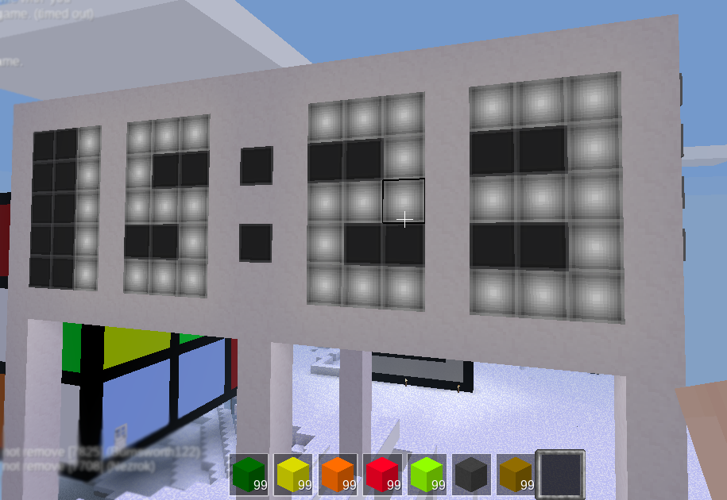
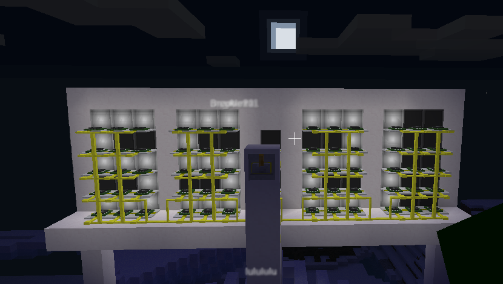
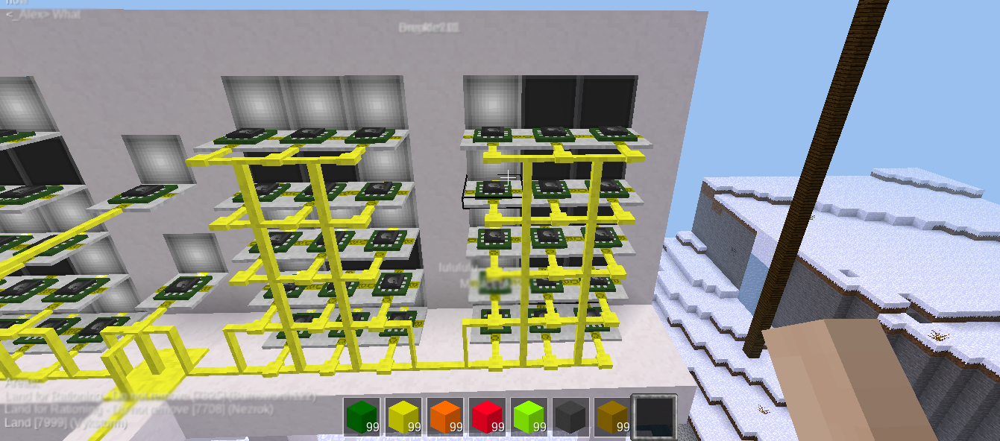
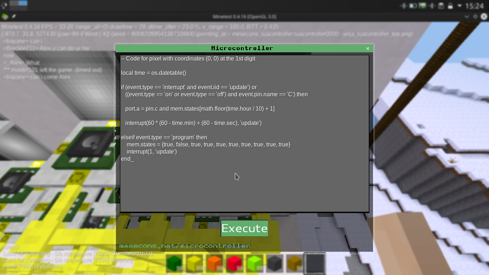

## Minetest digital clock

If your aim is to build a digital clock in-game on a minetest game with mesecons and without digilines mod, you can do it only
using only lua micro-controllers


The next pictures shows the digital clock finished







## How to build it

The display have 4 digits (the clock shows the server time with hh-mm format). <br>
Each digit has 5x3 pixels (5 rows and 3 columns). <br>
Each of this individual pixels can be manipulated (turn on/off) by a micro-controller (depending on the digit it's going to display) <br>


All micro-controllers must be programmed with lua code. Here it's an example for one of them:

```lua
local time = os.datetable()

if (event.type == 'interrupt' and event.iid == 'update') or
   ((event.type == 'on' or event.type == 'off') and event.pin.name == 'C') then

   port.a = pin.c and mem.states[math.floor(time.hour / 10) + 1]
   
   interrupt(60 * (60 - time.min) + (60 - time.sec), 'update')

elseif event.type == 'program' then
    mem.states = {true, true, true, true, true, true, true, true, true, true}
    interrupt(1, 'update')
end
```

To know how to generate the lua code for each micro-controller, you can run the python program i created located in [scripts/clock.py](scripts/clock.py)

The only dependency is the numpy library. You can install it via pip
```
pip install numpy
```
You could also use a virtual environment...
```
virtualenv -p /usr/bin/python3.6 myenv
./myenv/bin/activate
pip install numpy
```

Then clone this repository and execute the script

```
git clone https://github.com/Vykstorm/minetest-clock.git
cd minetest-clock/scripts
python3 clock.py
```

A file called [data/microcontrollers-code.txt](data/microcontrollers-code.txt) will be created with the lua code for the micro-controllers

Then you just need to copy the code and paste it on the micro-controllers program window <br>
